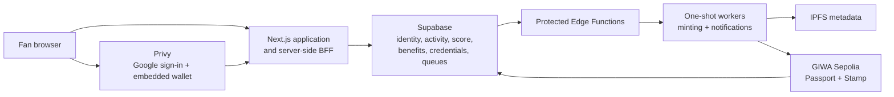

# System overview

ByUs uses a database-first product architecture with an asynchronous on-chain credential projection.



## Components

| Component | Responsibility |
| --- | --- |
| Next.js web application | Fan experience, internal operations UI, and server-side BFF |
| Privy | Google authentication and embedded EVM wallet provisioning |
| Supabase | Canonical fan, activity, score, benefit, credential, and queue state |
| Supabase Edge Functions | Protected scheduler-to-worker invocation and queue maintenance |
| AWS Lambda workers | One-shot minting and notification delivery |
| IPFS | Immutable credential metadata and artwork references |
| GIWA Sepolia | Public ownership and verification for Passport and Stamp credentials |

## Request boundary

The browser does not read private Supabase tables directly.

For a protected request, the Next.js BFF:

1. verifies the Privy access token;
2. resolves the canonical ByUs user;
3. verifies the embedded EVM wallet;
4. performs the owner-scoped operation with server credentials;
5. returns only the projection required by the product screen.

## Activity boundary

Fan activity, score, benefit eligibility, and operational state are recorded in Supabase.

The GIWA layer records:

- Passport ownership;
- Stamp ownership;
- token ID;
- mint transaction;
- immutable metadata URI.


ByUs does not put the full fan profile, quiz answers, attendance logs, Fan CRM, or benefit fulfillment data on-chain.


## Credential flow

```text
Fan action
  → authenticated BFF request
  → atomic Supabase business record
  → idempotent blockchain job
  → one-shot mint worker
  → IPFS metadata
  → GIWA transaction
  → receipt and event reconciliation
  → minted credential state
```

## Runtime packages

- `apps/web`: production fan product and BFF
- `apps/worker`: mint and notification workers
- `contracts`: soulbound Passport and Stamp contracts
- `supabase`: domain model, queues, read projections, and Edge Functions

Continue with [Data and privacy](data-and-privacy.md) and [Minting pipeline](minting-pipeline.md).
