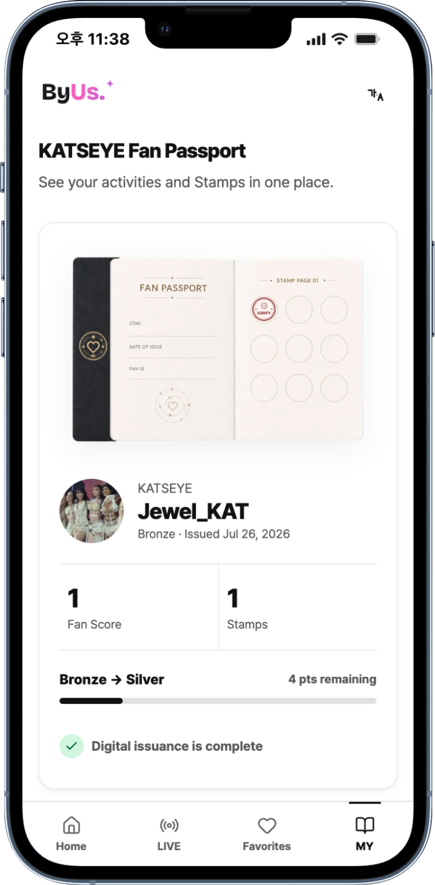

# Fan Passport

A Fan Passport is a creator-specific record of verified fan activity.

It connects what the fan did in the product with a durable ownership and verification record on GIWA.

<figure><figcaption>A Fan Passport combines identity, progress, activity, Stamps, and benefit context.</figcaption></figure>

## What a Passport contains

| Area | Purpose |
| --- | --- |
| Fan identity | Connects one ByUs fan to one creator context |
| Fan Score | Aggregates verified participation points |
| Fan level | Shows Bronze-to-Diamond progression |
| Stamp Book | Collects Knowledge, Reservation, Attendance, and Survey Stamps |
| Recent activity | Shows the actions that created the fan record |
| Benefits | Surfaces the next eligible fan experiences |
| GIWA proof | Shows token ID and transaction details after minting |

## Identity boundary

The current model creates **one Passport per fan and creator**.

This is intentionally different from:

- one global Passport shared by every creator;
- a follower profile based only on social reach;
- a transferable collectible that can be sold to another account.

## Lifecycle

1. The fan signs in and selects a creator.
2. The fan passes the creator-specific verification quiz.
3. Supabase records the Passport immediately with a `queued` mint state.
4. The mint worker issues the soulbound ERC-721 credential on GIWA Sepolia.
5. The Passport read model adds the token ID and transaction record after confirmation.
6. New fan activities update score, level, Stamps, and benefit eligibility off-chain.


The application database is the operational source of truth. The GIWA credential is the ownership and verification projection—not the storage location for the full fan profile.


## Contract properties

- Standard: ERC-721
- Transferability: soulbound
- Uniqueness: one token for each `passportId`
- Mint control: `MINTER_ROLE`
- Emergency control: `PAUSER_ROLE`
- Administration: delayed default-admin rules

See [Network and contracts](../giwa/network-and-contracts.md) for the deployed address and Explorer link.
