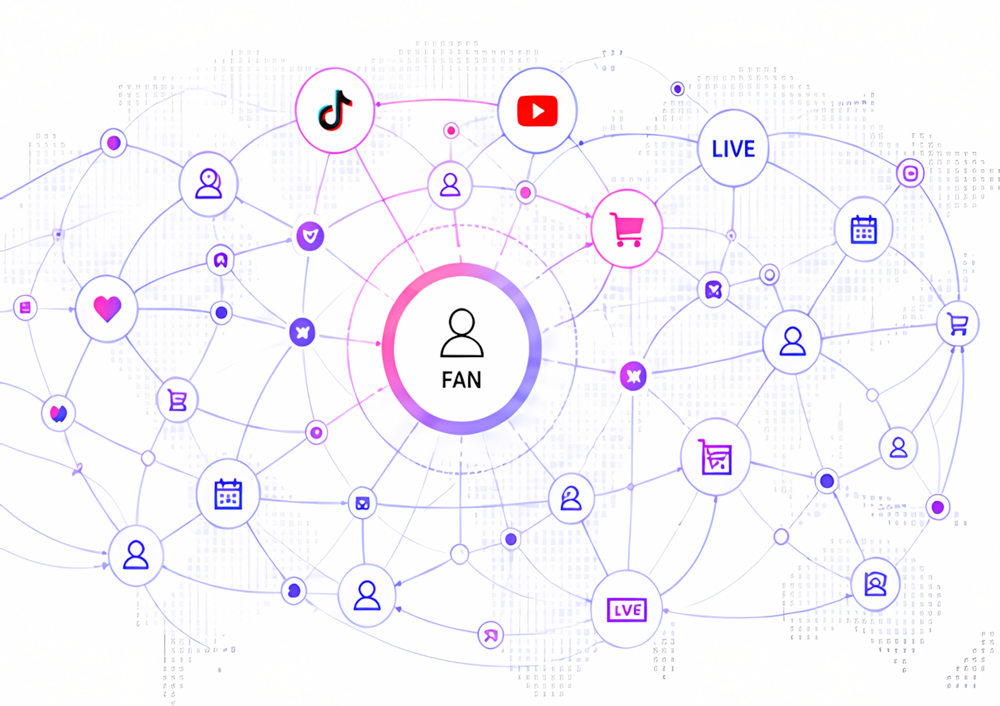

# Product direction

ByUs starts with working utility and expands only from verified fan behavior.

## Current: Fan Passport utility

The current MVP connects:

- Google sign-in;
- an embedded EVM wallet;
- creator discovery;
- fan verification;
- creator-specific Fan Passports;
- Knowledge, Reservation, Attendance, and Survey Stamps;
- Fan Score and levels;
- benefit eligibility and claims;
- GIWA Sepolia credential proof.

## Next: deeper fan relationships

The next product layer can build on the same verified activity model:

- richer fan relationship views;
- creator and brand operations;
- campaign and commerce connections;
- repeat benefits across LIVE activity;
- expanded creator and fan networks.

These features should extend the operational source of truth rather than move private Fan CRM data on-chain.

## Future: Global Fandom Graph

<figure><figcaption>Long-term concept: connect fan identity and activity across countries and platforms.</figcaption></figure>

The long-term direction is:

```text
Fan Passport
  → Fan relationship understanding
  → Fan commerce
  → Cross-platform fandom graph
```

> One Fan. Many Platforms. One Passport.

## Utility first

The MVP has **no tradable token**.

Any future token economy remains conditional on proven utility demand across fans, creators, brands, commerce, and benefits. Token design follows product fit; it does not precede it.

## Network direction

The current credential deployment is GIWA Sepolia. A mainnet migration is a future release decision and is not part of the current implementation.
