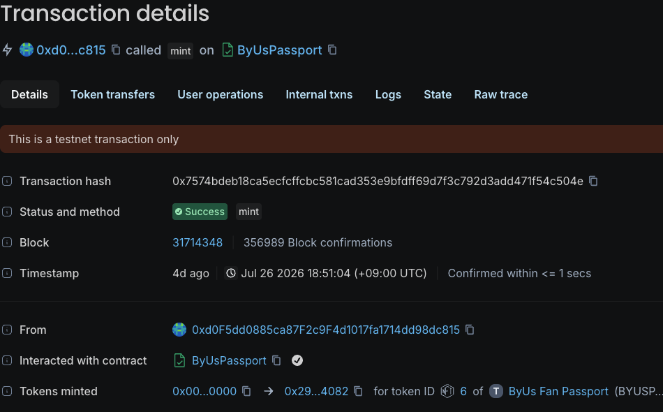
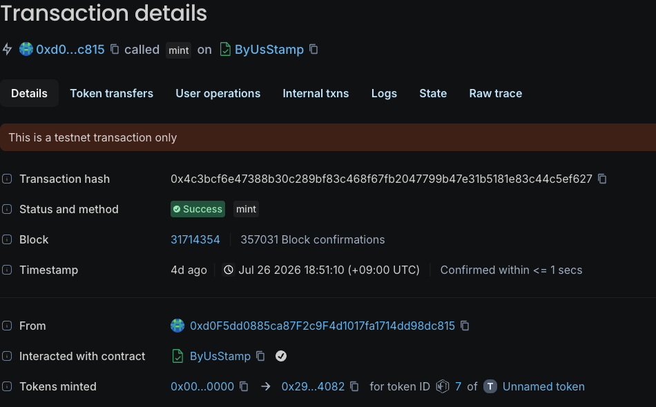

# MVP and on-chain proof

The current evidence set combines live product captures from [byus.kr](https://byus.kr/?locale=en) with successful transactions on the official GIWA Sepolia Explorer.

## Live product

<table data-view="cards">
  <thead>
    <tr>
      <th></th>
      <th></th>
      <th data-hidden data-card-target data-type="content-ref"></th>
      <th data-hidden data-card-cover data-type="files"></th>
    </tr>
  </thead>
  <tbody>
    <tr>
      <td><strong>Discover</strong></td>
      <td>Browse published creators and begin a fan journey.</td>
      <td><a href="https://byus.kr/?locale=en">https://byus.kr/?locale=en</a></td>
      <td><a href="../.gitbook/assets/discover-production.png">../.gitbook/assets/discover-production.png</a></td>
    </tr>
    <tr>
      <td><strong>Participate</strong></td>
      <td>Open a LIVE event and continue through reservation and attendance.</td>
      <td><a href="https://byus.kr/live/katseye-debut-watch-party?locale=en">https://byus.kr/live/katseye-debut-watch-party?locale=en</a></td>
      <td><a href="../.gitbook/assets/participate-production.png">../.gitbook/assets/participate-production.png</a></td>
    </tr>
    <tr>
      <td><strong>Verify</strong></td>
      <td>Complete the creator-specific fan verification flow.</td>
      <td><a href="https://byus.kr/c/katseye/verify?locale=en">https://byus.kr/c/katseye/verify?locale=en</a></td>
      <td><a href="../.gitbook/assets/verify-production.png">../.gitbook/assets/verify-production.png</a></td>
    </tr>
    <tr>
      <td><strong>Unlock benefits</strong></td>
      <td>Review benefits available to the fan.</td>
      <td><a href="https://byus.kr/benefits?locale=en">https://byus.kr/benefits?locale=en</a></td>
      <td><a href="../.gitbook/assets/benefit-production.png">../.gitbook/assets/benefit-production.png</a></td>
    </tr>
  </tbody>
</table>

## Successful Passport mint

<figure><figcaption>Fan Passport token #6 minted by the ByUs Passport contract.</figcaption></figure>

| Property | Value |
| --- | --- |
| Network | GIWA Sepolia |
| Chain ID | `91342` |
| Contract | [`0x17f9...Fca20`](https://sepolia-explorer.giwa.io/address/0x17f9FB7658A326DD88dB523739c227faf50Fca20) |
| Token ID | `6` |
| Transaction | [`0x7574...c504e`](https://sepolia-explorer.giwa.io/tx/0x7574bdeb18ca5ecfcffcbc581cad353e9bfdff69d7f3c792d3add471f54c504e) |
| Receipt status | Success |

## Successful Stamp mint

<figure><figcaption>Knowledge Stamp (fan verification) token #7 minted by the ByUs Stamp contract.</figcaption></figure>

| Property | Value |
| --- | --- |
| Network | GIWA Sepolia |
| Chain ID | `91342` |
| Contract | [`0x1AdC...92285`](https://sepolia-explorer.giwa.io/address/0x1AdCdE3473c4e884E60205b397ecE744D8892285) |
| Token ID | `7` |
| Transaction | [`0x4c3b...ef627`](https://sepolia-explorer.giwa.io/tx/0x4c3bcf6e47388b30c289bf83c468f67fb2047799b47e31b5181e83c44c5ef627) |
| Receipt status | Success |


Both transaction receipts returned `status: 0x1` from the GIWA Sepolia RPC on July 31, 2026. The emitted logs came from the Passport and Stamp contract addresses listed above.


## Evidence boundary

- Product images on this page are captures from the live ByUs product, not reconstructed interface mockups.
- The transactions are public testnet records.
- GIWA Sepolia is a test network; no real assets are used.
- Operational fan data and benefit delivery remain off-chain.
