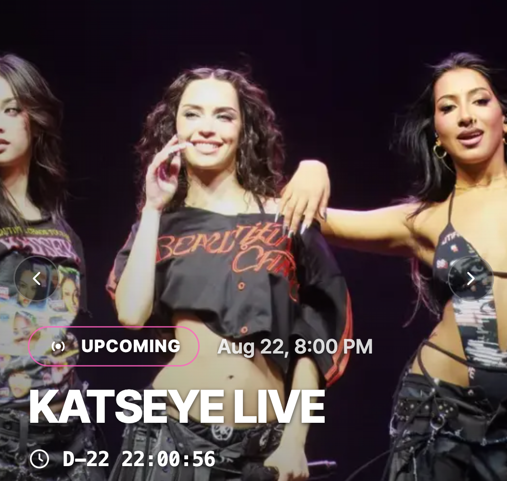
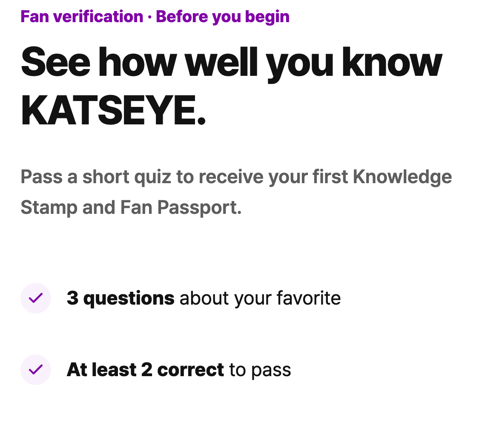

# Product journey

ByUs connects discovery, identity, participation, and benefits in one continuous fan journey.

## 1. Discover

<figure><figcaption>Discover creators, upcoming LIVE events, and active fan journeys.</figcaption></figure>

Fans browse published creators and upcoming LIVE events through:

- [Home](https://byus.kr/?locale=en)
- [LIVE](https://byus.kr/live?locale=en)
- [Celebrities](https://byus.kr/celebrities?locale=en)

The product surfaces the creator and LIVE first; Passport and benefit actions follow from that context.

## 2. Sign in and verify

<figure><figcaption>Creator-specific fan verification before the first Passport and Knowledge Stamp are issued.</figcaption></figure>

Fans sign in with Google. Privy provisions an embedded EVM wallet in the background, and the ByUs server verifies the identity and wallet before synchronizing the fan profile.

The fan then:

1. chooses a favorite creator;
2. sets a public nickname;
3. answers a three-question fan quiz;
4. passes with at least two correct answers.

A successful first verification creates the creator-specific Fan Passport, issues a Knowledge Stamp, and adds `+1` Fan Score.


Fans do not need to install a browser wallet or manage a seed phrase to enter the product journey.


## 3. Participate in LIVE

<figure><figcaption>Reserve a LIVE, watch on YouTube, and enter the Fan Code shared during the event.</figcaption></figure>

The current LIVE journey is:

```text
Reserve → Watch on YouTube → Enter Fan Code → Complete Survey
```

Each completed action creates an operational record and can issue a corresponding Stamp:

| Action | Record | Fan Score |
| --- | --- | ---: |
| Fan verification | Knowledge Stamp | `+1` |
| LIVE reservation | Reservation Stamp | `+1` |
| Fan Code entry | Attendance Stamp | `+3` |
| Post-LIVE survey | Survey Stamp | `+2` |

## 4. Collect and grow

The Fan Passport brings together:

- creator-specific fan identity;
- Fan Score and current level;
- progress toward the next level;
- Stamp Book;
- recent fan activity;
- available benefits;
- GIWA token ID and transaction details after minting.

## 5. Unlock benefits

<figure><figcaption>Benefits become claimable when the fan satisfies the configured participation requirements.</figcaption></figure>

Benefit eligibility can combine Fan Score, level, required Stamps or activities, claim period, and remaining inventory.

The key product principle is simple:

> Benefits are unlocked by verified participation—not follower count.

## System result

| Fan action | Product state | Verifiable projection |
| --- | --- | --- |
| Sign in | Canonical fan account and embedded wallet | Wallet address used as credential recipient |
| Pass verification | Passport, Knowledge activity, score | Passport and Knowledge Stamp mint jobs |
| Reserve LIVE | Reservation and score | Reservation Stamp mint job |
| Enter Fan Code | Attendance and score | Attendance Stamp mint job |
| Complete survey | Survey and score | Survey Stamp mint job |
| Claim benefit | Eligibility and claim delivery | Remains off-chain |

See [System overview](../architecture/overview.md) for the operational and on-chain responsibility boundary.
